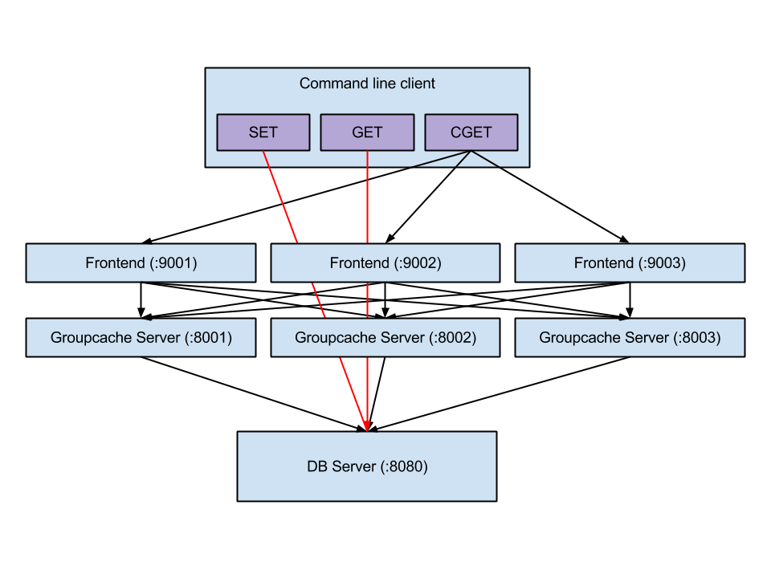

# groupcache源码分析

> [groupcache](github.com/golang/groupcache) is a caching and cache-filling library, intended as a replacement for memcached in many cases.

## 架构

groupcache是一个缓存库，也就是说不是一个完整的软件，需要自己实现main函数。上图是[Playing With Groupcache](http://capotej.com/blog/2013/07/28/playing-with-groupcache/)这篇博客的测试程序架构，客户端和groupcache通过rpc进行通信，而groupcache peer之间通过http协议进行通信；这是比较好的做法，因为如果客户端与服务器通信和groupcache之间通信采用的是同一个端口，那么在并发量上去的时候，会严重影响性能。如果客户端用的是set或get命令时，这时直接操作的是数据源(数据库或文件)，如果调用的是cget命令，则从groupcache中查找数据。

## consistenthash

consistenthash 包实现了一致性哈希，使得某个key的拥有者保持不变

## lru

lru包使用containers/list双向列表实现lru算法

## singleflight

singleflight包使用sync.waitGroup实现函数多次调用合并为一次调用